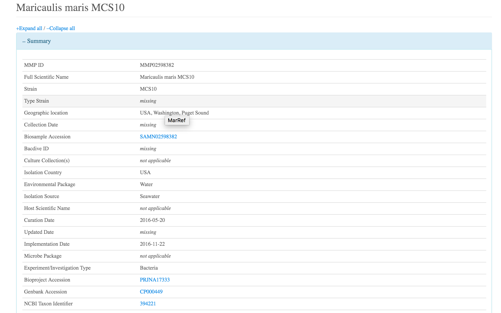
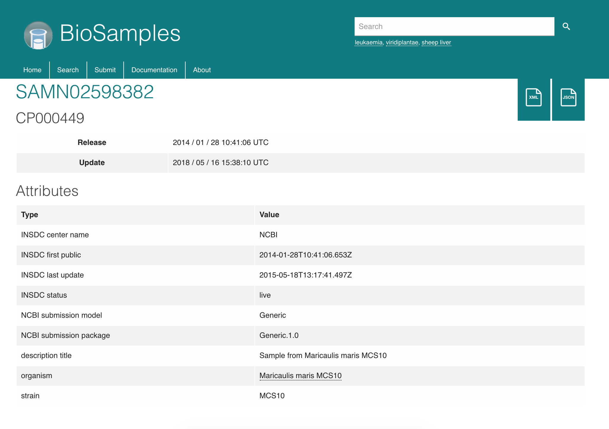
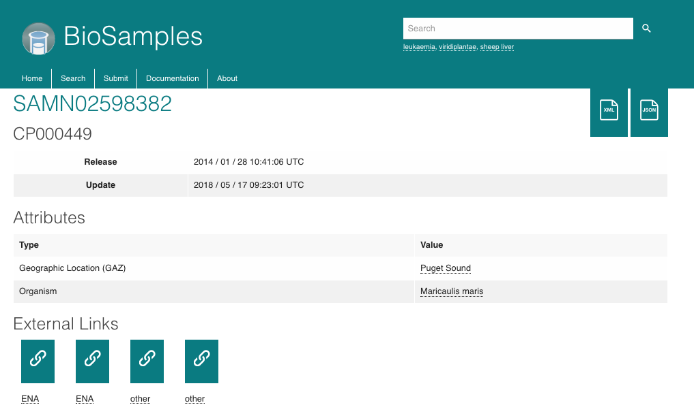

# MarRef demo summary

## Aim of the demo

The scope of the MarRef demo is to give a practical example on
how Bioschemas profiles could be used to export highly curated metadata
in services that don't provide an Application Programming Interface (API)
and how such metadata could be use by external services, like the BioSamples database,
to improve the quality of the sample stored.

## Organisation of the demo

The demo uses a set of DockeContainer to:

1. Present a subset of samples extracted from the MarRef database as example
2. Run the [bsbang-crawler](https://github.com/justinccdev/bsbang-crawler) to extract metadata from MarRef
3. Store the results in a Solr index for searching purposes
4. Curate BioSamples database available locally - but [outside of this repository](https://github.com/EBIBioSamples/biosamples-v4)

A `demo.py` small command line application has been built to step through the different phases of the demo

## Steps

### 1. Setup the environment

Not a lot to say here, the setup instantiate the local sandbox with a set of MarRef samples available as 
HTML pages

### 2. Convert MarRef metadata to Bioschemas markup and embed it in the webpages

We then proceed converting some of the metadata available in MarRef sample pages to Bioschemas markup. This has been then embedded
inside of the HTML with as json+ld and it will be used for the next step.

- Check out the produced bioschemas markup [here](site/src/bioschemas/MMP00017418.json)
- Check out the embedded markup in the HTML [here](site/src/MMP00017418.html#L37)

### 3. Crawl sandbox and generate a Solr index

In this step, using the bsbang crawler we extract the Bioschemas markup embedded in the MarRef demo pages and
we store in a in-memory database. This step is to prove how we can access to the data using Bioschemas and store it
somewhere else, and use such data to build services or improve quality of samples stored elsewhere, like we will
show in step number 4. 

During this step we will use the stored data to create a simple search service using Solr.

### 4. Curate BioSamples

Last step is BioSamples curation. This steps uses the data extracted by the crawler to generate curation object
and use them to curate BioSamples samples associated to MarRef samples.

**Note:** This is just a proof of concept with some attributes and links to external databases

Let's start showing how the MarRef sample page looks and how the BioSamples corresponding samples looks

MarRef sample

BioSamples sample

Running our script we are able to generate curation object and submit them to BioSamples to get back a curated version
of the Sample. In BioSamples a curation is a layer put on top of the original sample, and each curation has
a domain that let you track the submitter of the curation itself. In our case we use a curation domain called
`MarRefCuration`, and this information ideally could be used to expose the curator in the user interface, e.g. showing
a badge saying "Resource curated by MarRef"

## Conclusions

Bioschemas markup is a very powerful tool that can be easily embed in pages and used to export metadata not available 
using other means, like an API. 
We were able to:

- Produce an example of the Bioschemas markup that could be generated from the MarRef database
- Use a crawler to extract that information and store it in a separate database for future reference
- Use the extracted mark up to curate an external service (BioSamples) without the need for MarRef to create complex
  API infrastructure
  
